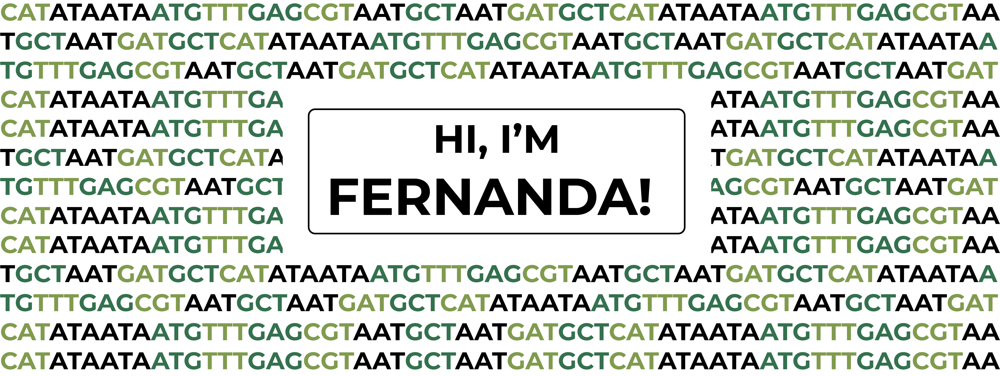

## Hi there 🧬

I’m Fernanda, a Master student at [Reynold's Lab](https://www.reynoldslab.org/people), who specializes on bioinformatics analysis of omics data. Some things about me:

📊 Self-proclaimed expert on doing cute graphs with R
\
🧬 Currently working with WGS data to better understand Mexican Populations
\
🌱 Currently working with epigenomic data to better understand rare diseases
\
🥑 Latina in science

## 📌 Pinned Repositories

